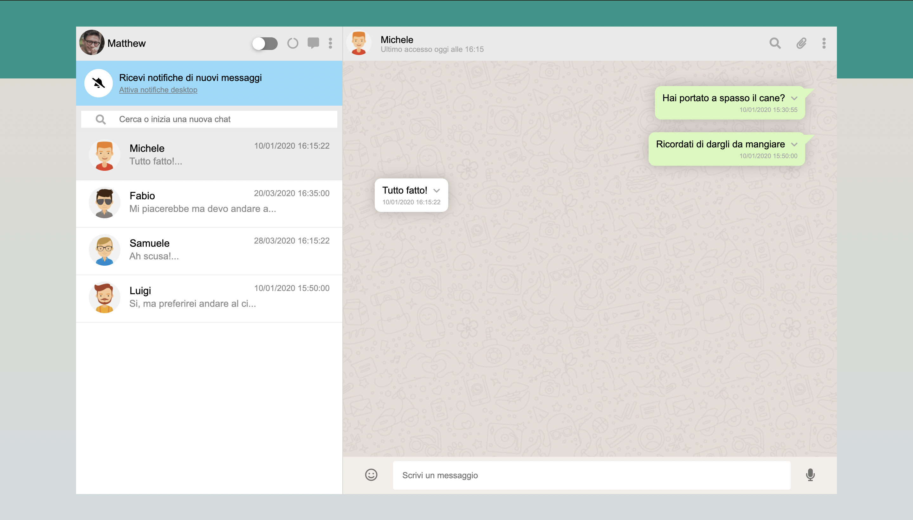
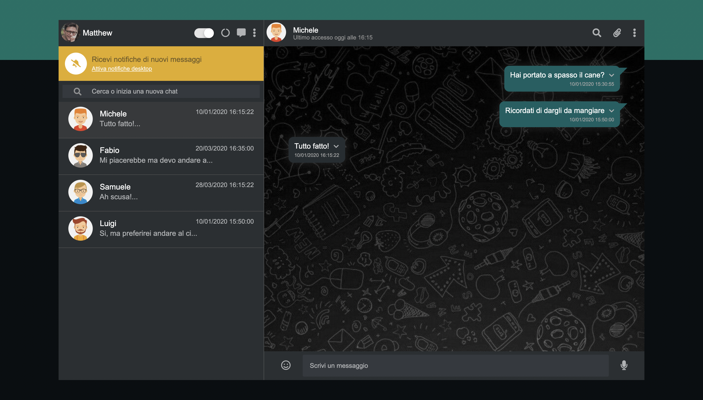
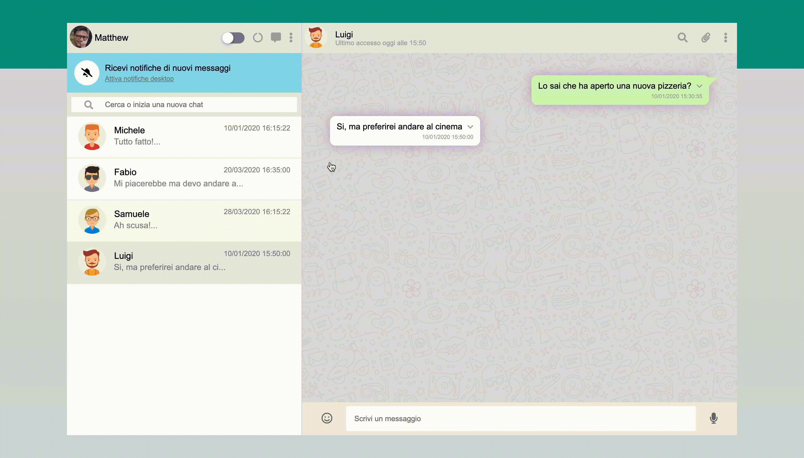

# BoolZapp with VueJS
Replicating whatsapp with VueJS (BoolZapp), available in two different cool modes

## Light Mode

## Dark Mode

## Switching Mode
#### You can easily switch mode by clicking the button next to your BoolZapp name!

## Send Messages
#### You can also send messages and interact with the computer

## Delete Messages
#### And last but not least you can delete your messages, whatsapp style!

